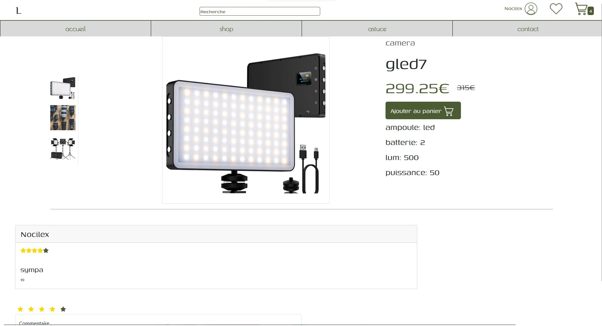
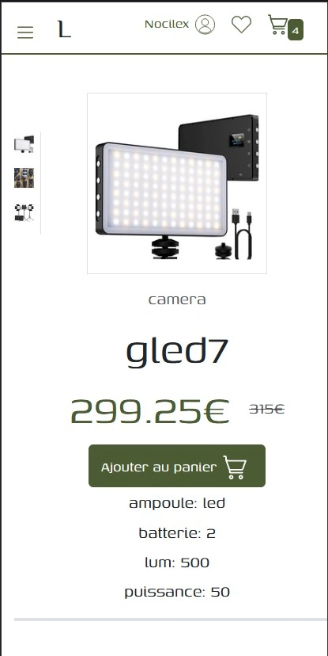

# Lumectif

## Auteur:
> ADAM Corentin
> corentin.adam9@etu.univ-lorraine.fr
> CHATTAH ANASS
> anass.chattah1@etu.univ-lorraine.fr

## A propos de lumectif:

> Lumectif est un site d'achat de matériel audiovisuel. Le site web vent des articles de différentes catégories. Camera, objectif, lumière, steadycam. Avec une sélection de matériel de qualité mais abordable, Lumectif fera le bonheur de tous les amateurs passionnés d'audiovisuel. De plus, Lumectif fournit des astuces et conseil sur l'utilisation de matériel audiovisuel.

## l'arborescense de Lumectif:

***
└── LUMECTIF/
    ├── css/
    │   └── scss /
    │       ├── barNav.css
    │       ├── common.css
    │       ├── index.css
    │       ├── perso.css
    │       ├── perso.css.map
    │       ├── perso.scss
    │       └── produits.css
    ├── dist/
    │   └── medias/
    │       ├── background
    │       ├── icon
    │       ├── materiel
    │       └── readme
    └── pages/
        └── composants/
            ├── bibliotheque.php
            ├── étoiles.php
            ├── footer.php
            ├── article.html
            ├── article.php
            ├── astuce.php
            ├── connexion.php
            ├── connexionSecur.php
            ├── contact.php
            ├── decoSecur.php
            ├── envoiMail.php
            ├── index.php
            ├── inscription.php
            ├── inscriptionSecur.php
            ├── insertAv.php
            ├── modernite.php
            ├── moderniteaveciconesadministration.php
            ├── pageUtilisateur.php
            ├── panier.php
            ├── panierSecur.php
            ├── paniersuppr.php
            ├── produit.html
            ├── produit.php
            ├── resetMDP.php
            ├── resetMdpSecu.php
            ├── tarifs.php
            ├── 404 Not Found.html
            ├── BarNav.html
            ├── bibli copy.css
            ├── bibli copy.html
            ├── bibli.css
            ├── bibli.php
            └── readme.md
***

---
## Hebergement
#### Lien:
##### webetu https://webetu.iutnc.univ-lorraine.fr/~adam265u/sae203-lumectif/
##### alwaysData http://lumectif.alwaysdata.net

On à choisie alwaysData était dans la liste de proposition des hebergeur. Son interface est propre et il est plutôt simple d'utilisation
Il n'a pas eu de problème pour l'heberger

## Integration Web
### W3C:
### composants Bootstrap:
### Responsive:
>Pour gérer la responsivité de LUMECTIF, nous avons utilisé plusieurs class de bootstrap:
>- les collones (col-md-5/col-10) pour pour gérer la taille des élément selon la taille de l'écran.
>- le display (d-md-flex/d-bloc) pour pouvoir mettre les élement l'un en dessous de l'autre selon la taille de l'écran
>- les marges (ms-md-5/ms-10) pour changer la taille des marges selon la taille de l'écran
>- La barre de navigation à été realisée en css avec les mediasqueries
>
>
>

---

## Développement Web:
>#### Contenue dynamisé:
>- La liste des article (article.php)
>- chaque produit et ses caractèristiques (produit.php)
>- la liste des fabriquants dans les filtre (article.php)
>- Le compte de l'utilisateur (navBar/connexion.php)
>- les avis entrés par l'utilisateur (produit.php)
>- les categories (index.php)
>- les astuces (astuces.php/articles.php)
>- le panier de l'utilisateur (navBar/panier.php)

### La dynamisation du compte:
>Pour la dynamisation du compte l'utilisateur doit s'inscrire en rentrant son login, son mot de passe et la confirmation du mot de passe. Les données soit envoyer par méthode POST à une page de connexion sécurisé. Le mot de passe et stocké dans sa version hacher et les variables rentrées par l'utilisateur sont converties avec htmlentities pour éviter les attaques par injection de code. Les valeurs sont stockées dans la table lum_utilisateur par la requête SQL UPDATE. Quand l'utilisateur se connecte, le mot de passe rentré et haché et comparé avec celui de la base de données. Si les champs sont remplis et qu’ils sont valide, la variable super global $_SESSION prend deux l'état de true si la connexion et réussie ou error si la connexion à échouée.
Pour la deconexion, l'utilisateur clique sur le bouton de deconexion ce qui le redirige vers la page decoSecur.php qui detruit le session et redirige vers la page d'acceuil.

## Système d'information et bases de données:

## lien SQL
## MCD
## structure table
## requête SQL
>- (SELECT `nom_f`,`id_f` FROM `lum_fabricant`)
>- (SELECT * FROM `lum_article` LEFT JOIN `lum_avis` ON lum_avis.id_a = lum_article.id_a JOIN `lum_categorie` ON lum_article.id_ca = lum_categorie.id_ca LEFT JOIN `lum_propose` ON lum_article.id_a = lum_propose.id_a LEFT JOIN `lum_fabricant` ON lum_propose.id_f = lum_fabricant.id_f)
>- (SELECT * FROM `lum_utilisateur` WHERE lum_utilisateur.mail_ut = 'pseudi_ut')
>- (SELECT mail_ut FROM lum_utilisateur WHERE lum_utilisateur.mail_ut = 'mail_ut')
>- (NSERT INTO lum_utilisateur(pseudo_ut, mdp_ut, mail_ut) VALUES ('nom', 'mdp', 'mail'))
>- (INSERT INTO lum_avis(note_av, avis_av, id_ut, id_a) VALUES ('note', 'avis', 'idUser','produit'))
>- (SELECT lum_article.*, lum_achete.*
    FROM `lum_article`
    JOIN `lum_achete`
    ON lum_article.id_a = lum_achete.id_a
    JOIN `lum_utilisateur`
    ON lum_achete.id_ut = lum_utilisateur.id_ut
    WHERE lum_utilisateur.id_ut = 2);
    >- 